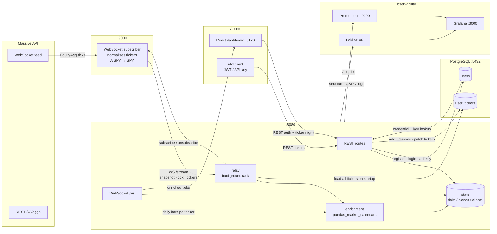

# finpipe-faucet

Real-time equity price streaming. Connects to the Massive WebSocket feed, enriches tick data, and serves live prices to a browser dashboard.

## Architecture



### Process flow

#### Startup
1. `db.init()` — connect pool, create `users` and `user_tickers` tables if missing
2. `get_all_tickers()` — load every distinct ticker across all users from DB
3. `load_prev_closes()` — call `pandas_market_calendars` (NYSE) once to get `prev_date`, `5d_ago`, `ytd_start`; fire one Massive REST request per ticker concurrently
4. `relay.run()` — connect to ingestion `/stream`, subscribe to all startup tickers, begin streaming

#### Tick lifecycle
```
Massive WebSocket
  → Ingestion (normalise ticker, broadcast raw tick)
  → Relay (receive tick)
  → enrich_tick() (lookup state.prev_closes / closes_5d / closes_ytd)
      adds: change, changePct, prevClose, perf5d, perfYtd
  → state.ticks updated
  → broadcast to all UI WebSocket clients
```

#### User adds a ticker
```
UI → POST /external/tickers/{ticker}
  → DB: insert into user_tickers
  → send_to_consumer({action: subscribe})
  → Ingestion subscribes to Massive feed
  → if not cached: _trading_dates() + _fetch_closes() → state updated
  → Massive starts streaming ticks for that ticker
```

#### Relay reconnect (on ingestion disconnect)
```
WebSocket closed → log warning → _consumer_ws = None → sleep 3s → reconnect
→ re-subscribe all startup tickers → receive snapshot → broadcast to UI clients
```

- **ingestion** — subscribes to the Massive WebSocket feed, normalises tickers (`A.SPY` → `SPY`), exposes `/stream`
- **relay** — background asyncio task; consumes ingestion stream, enriches ticks, broadcasts to UI clients
- **enrichment** — uses `pandas_market_calendars` (NYSE) to resolve exact trading dates; fetches `prev_close`, `5d_close`, `ytd_close` from Massive REST in one call per ticker
- **state** — module-level shared memory: `ticks`, `prev_closes`, `closes_5d`, `closes_ytd`, `ui_clients`, `_consumer_ws`
- **ui** — React + Vite dashboard; connects via WebSocket, manages watchlist via REST

## Prerequisites

- Python 3.12+
- [uv](https://docs.astral.sh/uv/getting-started/installation/)
- Node.js + npm
- Docker (for PostgreSQL)

## Setup

```bash
# 1. Configure environment
cp .env.example .env
# Edit .env and add your MASSIVE_API_KEY

# 2. Start the database
docker compose up -d

# 3. Install dependencies
uv sync
cd ui && npm install && cd ..
```

## Run

```bash
uv run python main.py
```

Then open `http://localhost:5173`. Register an account and add ticker symbols to start streaming live prices.

## Environment Variables

| Variable | Description |
|---|---|
| `MASSIVE_API_KEY` | API key for the Massive WebSocket feed |
| `POSTGRES_PASSWORD` | Password for the PostgreSQL database |
| `DATABASE_URL` | Full PostgreSQL connection string |
| `JWT_SECRET` | Secret key for signing JWT tokens |

## API

### Auth

```
POST   /external/auth/register         create account → JWT
POST   /external/auth/login            login → JWT
POST   /external/api-key               generate API key (JWT required)
```

### Tickers

```
GET    /external/tickers/list          list watchlist (JWT or API key)
POST   /external/tickers/{ticker}      add ticker (JWT)
DELETE /external/tickers/{ticker}      remove ticker (JWT)
PATCH  /external/tickers               batch add/remove (JWT or API key)
```

### WebSocket

```
WS     /ws?token={JWT}                 stream enriched ticks
```

### Internal

```
GET    /internal/health                pipeline status (localhost only)
GET    /metrics                        Prometheus metrics
```

## Tech Stack

| Layer | Technology |
|---|---|
| Backend | Python 3.12 + FastAPI + asyncpg |
| Frontend | React 18 + TypeScript + Vite |
| Database | PostgreSQL 17 (Docker) |
| Auth | JWT + bcrypt |
| Data source | Massive WebSocket API |
