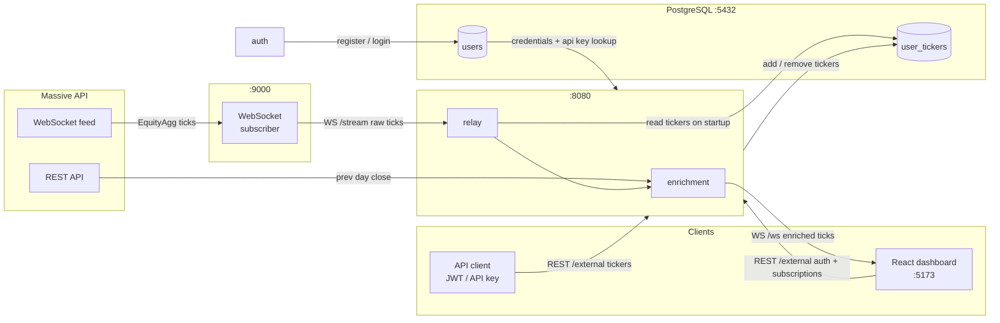

# finpipe-faucet

Real-time equity price streaming. Connects to the Massive WebSocket feed, enriches tick data, and serves live prices to a browser dashboard.

## Architecture



- **ingestion** — subscribes to the Massive WebSocket API and streams raw ticks
- **api/relay** — enriches ticks with previous close data, relays to browser clients via WebSocket, exposes REST API
- **ui** — React + Vite dashboard showing live prices, change %, and volume

## Prerequisites

- Python 3.12+
- [uv](https://docs.astral.sh/uv/getting-started/installation/)
- Node.js + npm
- Docker (for PostgreSQL)

## Setup

```bash
# 1. Configure environment
cp .env.example .env
# Edit .env and add your MASSIVE_API_KEY

# 2. Start the database
docker compose up -d

# 3. Install dependencies
uv sync
cd ui && npm install && cd ..
```

## Run

```bash
uv run python main.py
```

Then open `http://localhost:5173`. Register an account and add ticker symbols to start streaming live prices.

## Environment Variables

| Variable | Description |
|---|---|
| `MASSIVE_API_KEY` | API key for the Massive WebSocket feed |
| `POSTGRES_PASSWORD` | Password for the PostgreSQL database |
| `DATABASE_URL` | Full PostgreSQL connection string |
| `JWT_SECRET` | Secret key for signing JWT tokens |

## API

### Subscriptions

```
GET    /subscriptions            list active tickers
PUT    /subscriptions/{ticker}   add ticker
DELETE /subscriptions/{ticker}   remove ticker
```

### Auth

```
POST   /auth/register            create a new account
POST   /auth/login               login and receive a JWT
```

## Tech Stack

| Layer | Technology |
|---|---|
| Backend | Python 3.12 + FastAPI + asyncpg |
| Frontend | React 18 + TypeScript + Vite |
| Database | PostgreSQL 17 (Docker) |
| Auth | JWT + bcrypt |
| Data source | Massive WebSocket API |
